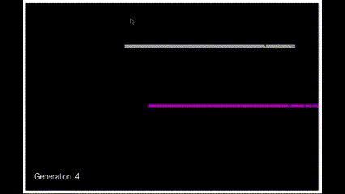
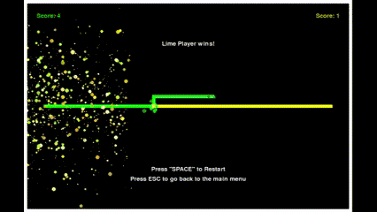
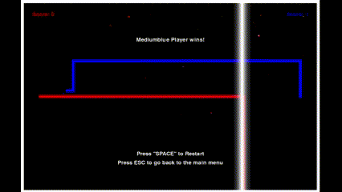

# Tron Game with AI and NEAT Implementation

## Visuals

### Training NEAT AI

### Versus AI (Yellow)

### Player vs Player Head On

### Border Crash

## Description
This enhanced version of the classic Tron game, created using Pygame, places a significant emphasis on its sophisticated AI systems, particularly highlighting the implementation of the NEAT (NeuroEvolution of Augmenting Topologies) algorithm. The project features two distinct AI opponents: a manually coded AI and an AI based on NEAT.

The manually programmed AI is designed to mimic human-like play, providing players with a challenging yet familiar experience. Its strategies and decision-making processes are crafted to resemble those of human players, adding a layer of intuitive gameplay.

In contrast, the NEAT-based AI represents a foray into the realm of evolutionary AI and machine learning. This AI is a key feature of the project, showcasing the ongoing evolution and learning process of an AI within the Tron game environment. Although currently less proficient in the game, the NEAT AI offers an intriguing perspective on the complexities and potential of AI development in gaming, highlighting the project's focus on cutting-edge AI research and application.

## Features
- **Engaging Visuals**: Enhanced graphics for a more immersive Tron experience.
- **Custom AI Opponent**: A specially designed AI that simulates human-like playing patterns.
- **NEAT Algorithm**: An implementation of the NEAT algorithm to evolve and train AI through self-play.
- **Human vs. AI Gameplay**: Players can test their skills against the custom AI or the best performing NEAT-trained AI.

## NEAT Algorithm Challenges
The current implementation of the NEAT algorithm in this project faces significant difficulties in mastering Tron. Numerous configurations and approaches have been tried, but they have yet to yield successful learning outcomes. This presents an exciting area for future exploration and development.

## Future Work
- **Enhancing the NEAT Algorithm**: Focused efforts on getting the NEAT algorithm to a point of convergent behavior.
- **Reinforcement Learning**: Implementing reinforcement learning techniques to further improve AI performance.
- **UI Enhancements**: Adding more UI features to visualize the AI learning process and make the game more user-friendly.
- **NEAT Customization GUI**: Introducing a user-friendly interface for adjusting NEAT settings, complete with multi-threading for real-time results and live statistics.

## Contact
Email: christopherjthomaswork@gmail.com
